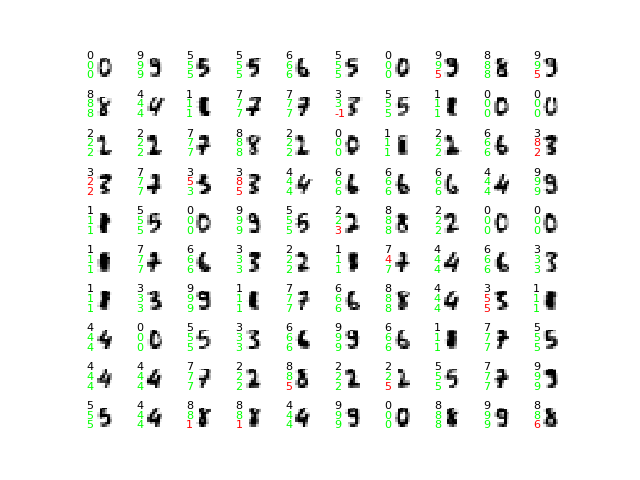

# symbolic-nn

Comparison of sklearn's MLPClassifier and a symbolic NN implementation on sklearn's `digits` dataset.

Exemplary results:
```
Scores on test data
  sklearn-mlp: 0.94
  symbolic-mlp: 0.87
```
and corresponding classification for the test set of 100 hand-written digits:



For every digit: black number (top-left corner) is target, second number (mid-left) is sklearn's result and third number (bottom-left corner) is the symbolic NN's result. A value of `-1` indicates an inconclusive prediction.
